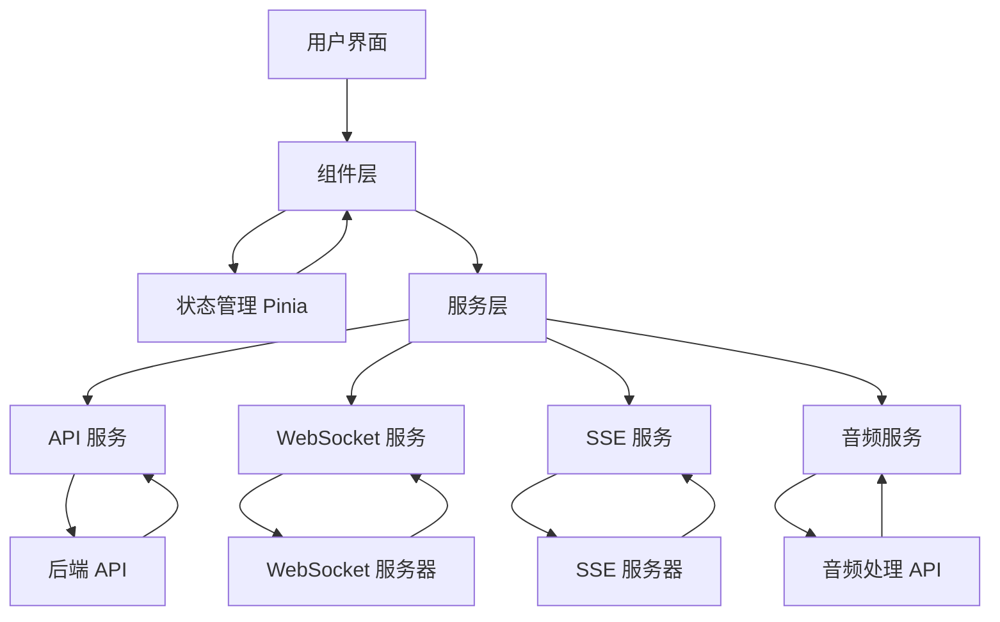

# AI 面试系统

基于 Vue3 + TypeScript + Vite 构建的智能 AI 面试平台，支持语音输入、多轮对话、智能评分和可视化分析。

## 🚀 技术栈

### 前端框架
- **Vue 3** - 渐进式 JavaScript 框架
- **TypeScript** - 类型安全的 JavaScript 超集
- **Vite** - 下一代前端构建工具

### 状态管理
- **Pinia** - Vue 官方推荐的状态管理库

### UI 组件库
- **Element Plus** - 基于 Vue 3 的组件库

### 数据可视化
- **ECharts** - 强大的图表库
- **vue-echarts** - Vue 3 的 ECharts 包装器

### 网络通信
- **Axios** - HTTP 客户端
- **WebSocket** - 实时双向通信
- **SSE (Server-Sent Events)** - 服务器推送事件

### 音频处理
- **Web Audio API** - 音频录制和播放
- **MediaRecorder API** - 音频录制

### 工具库
- **mitt** - 事件总线
- **dayjs** - 日期处理库

## 📁 项目结构

```
ai-interview/
├── src/
│   ├── assets/                    # 静态资源
│   │   ├── images/               # 图片资源
│   │   └── mock/                 # 模拟数据
│   │       └── interviews.ts     # 面试数据模拟
│   │
│   ├── components/               # 通用组件
│   ├── config/                   # 配置文件
│   │   └── index.ts             # 应用配置
│   │
│   ├── router/                   # 路由配置
│   │   └── index.ts             # 路由定义
│   │
│   ├── service/                  # 服务层
│   │   ├── api.ts               # API 接口
│   │   ├── websocket.ts         # WebSocket 服务
│   │   ├── sse.ts               # SSE 服务
│   │   └── audio.ts             # 音频服务
│   │
│   ├── store/                    # 状态管理
│   │   └── index.ts             # Pinia store
│   │
│   ├── styles/                   # 样式文件
│   │   ├── index.scss           # 全局样式
│   │   └── variables.scss       # 变量定义
│   │
│   ├── types/                    # 类型定义
│   │   └── index.ts             # TypeScript 类型
│   │
│   ├── utils/                    # 工具函数
│   │   └── index.ts             # 通用工具
│   │
│   ├── views/                    # 页面组件
│   │   ├── Login.vue            # 登录页面
│   │   ├── layout/              # 布局组件
│   │   │   └── MainLayout.vue   # 主布局
│   │   ├── interview/           # 面试相关页面
│   │   │   └── Interview.vue    # AI面试页面
│   │   ├── history/             # 历史相关页面
│   │   │   └── History.vue      # 面试历史页面
│   │   └── report/              # 报告相关页面
│   │       └── Report.vue       # 面试报告页面
│   │
│   ├── App.vue                   # 根组件
│   └── main.ts                   # 应用入口
│
├── public/                       # 公共资源
├── index.html                    # HTML 模板
├── package.json                  # 依赖管理
├── vite.config.ts               # Vite 配置
├── tsconfig.json                # TypeScript 配置
└── README.md                    # 项目文档
```

## 🎯 核心功能

### 1. 用户认证
- 用户登录/注册
- JWT 令牌认证
- 会话管理
- 记住我功能

### 2. AI 面试
- 智能面试官（基于 GPT）
- 多轮对话记忆
- 实时语音识别
- 文本输入支持
- 面试计时器

### 3. 语音处理
- 实时音频录制
- 音频波形可视化
- 语音转文本
- 文本转语音
- 音频文件处理

### 4. 实时通信
- WebSocket 双向通信
- Server-Sent Events 推送
- 实时消息同步
- 在线状态管理

### 5. 智能分析
- 面试表现评分
- 能力雷达图分析
- 对话情感分析
- 改进建议生成
- 趋势分析

### 6. 数据可视化
- ECharts 图表集成
- 实时数据更新
- 响应式图表
- 导出功能

### 7. 历史管理
- 面试记录查询
- 统计分析
- 数据导出
- 报告生成

## 🛠️ 环境要求

- Node.js 18+ 或 20+
- npm 9+ 或 yarn 1.22+ 或 pnpm 8+

## 🔧 安装与运行

### 1. 克隆项目
```bash
git clone <repository-url>
cd ai-interview
```

### 2. 安装依赖
```bash
npm install
# 或
yarn install
# 或
pnpm install
```

### 3. 配置环境变量
复制 `.env.example` 文件并重命名为 `.env`：
```bash
cp .env.example .env
```

编辑 `.env` 文件：
```env
# 应用配置
VITE_APP_TITLE=AI 面试系统
VITE_APP_VERSION=1.0.0

# API 配置
VITE_API_BASE_URL=http://localhost:3000/api
VITE_WS_URL=ws://localhost:3000/ws
VITE_SSE_URL=http://localhost:3000/sse

# OpenAI 配置（可选）
VITE_OPENAI_API_KEY=your_openai_api_key_here

# 调试模式
DEBUG=true
```

### 4. 启动开发服务器
```bash
npm run dev
# 或
yarn dev
# 或
pnpm dev
```

浏览器访问：http://localhost:3000

### 5. 构建生产版本
```bash
npm run build
# 或
yarn build
# 或
pnpm build
```

### 6. 预览生产版本
```bash
npm run preview
# 或
yarn preview
# 或
pnpm preview
```

## 📦 主要依赖说明

### 开发依赖
```json
{
  "@vitejs/plugin-vue": "Vue 3 的 Vite 插件",
  "@vue/tsconfig": "Vue 的 TypeScript 配置",
  "typescript": "TypeScript 编译器",
  "vite": "构建工具",
  "vue-tsc": "Vue 的 TypeScript 检查",
  "@types/node": "Node.js 类型定义",
  "eslint": "代码检查",
  "eslint-plugin-vue": "Vue ESLint 插件",
  "@typescript-eslint/eslint-plugin": "TypeScript ESLint 插件",
  "@typescript-eslint/parser": "TypeScript ESLint 解析器",
  "prettier": "代码格式化",
  "@element-plus/icons-vue": "Element Plus 图标"
}
```

### 生产依赖
```json
{
  "vue": "Vue 3 核心库",
  "vue-router": "Vue 路由",
  "pinia": "状态管理",
  "element-plus": "UI 组件库",
  "echarts": "图表库",
  "vue-echarts": "Vue 的 ECharts 包装器",
  "axios": "HTTP 客户端",
  "sass": "CSS 预处理器",
  "mitt": "事件总线",
  "@element-plus/icons-vue": "Element Plus 图标"
}
```

## 🔌 服务层架构

### API 服务 (`src/service/api.ts`)
- 封装所有 HTTP 请求
- 请求/响应拦截器
- 错误处理
- 请求重试机制

### WebSocket 服务 (`src/service/websocket.ts`)
- 实时双向通信
- 自动重连机制
- 事件订阅/发布
- 连接状态管理

### SSE 服务 (`src/service/sse.ts`)
- 服务器推送事件
- 实时数据更新
- 长连接管理
- 事件监听器

### 音频服务 (`src/service/audio.ts`)
- 音频录制/播放
- 音频格式转换
- 波形可视化
- 音频处理工具

## 📊 数据流架构



## 🎨 主题定制

### 主题配置
项目使用 Element Plus 的全局主题配置，可以在 `src/main.ts` 中修改：

```typescript
import ElementPlus from 'element-plus'

app.use(ElementPlus, {
  size: 'default', // 组件尺寸: large | default | small
  zIndex: 2000, // 弹出层 z-index
  locale: zhCn // 国际化
})
```

### 自定义样式
1. 修改 `src/styles/variables.scss` 中的变量
2. 在组件中使用 `scoped` 样式
3. 使用 CSS 自定义属性

## 🔒 安全性

### 前端安全措施
- JWT 令牌认证
- 输入验证和过滤
- XSS 防护
- CSRF 防护
- 敏感信息加密存储
- API 请求限流

### 环境变量管理
- 敏感信息存储在环境变量中
- 不同环境使用不同配置
- 配置文件不上传到版本控制

## 📈 性能优化

### 代码优化
- 组件懒加载
- 路由懒加载
- 代码分割
- 图片懒加载
- 虚拟滚动

### 构建优化
- Tree Shaking
- Gzip 压缩
- 图片优化
- CDN 加速
- 缓存策略

### 运行时优化
- 防抖和节流
- 请求缓存
- 本地存储
- Web Workers
- Service Worker

## 🧪 测试策略

### 单元测试
- Jest + Vue Test Utils
- 组件测试
- 工具函数测试
- 状态管理测试

### E2E 测试
- Cypress
- 用户流程测试
- 跨浏览器测试
- 性能测试

### 集成测试
- API 接口测试
- WebSocket 连接测试
- 第三方服务集成测试

## 📱 响应式设计

### 断点配置
```scss
$breakpoints: (
  'xs': 0,
  'sm': 576px,
  'md': 768px,
  'lg': 992px,
  'xl': 1200px,
  'xxl': 1400px
);
```

### 适配策略
- 移动端优先设计
- 弹性布局
- 响应式图表
- 触摸友好交互

## 🌍 国际化

### 支持语言
- 中文（简体）
- 英文

### 实现方式
- Vue I18n 集成
- 动态语言切换
- 日期时间本地化
- 货币和数字格式化

## 📚 开发规范

### 代码规范
- ESLint + Prettier 代码格式化
- TypeScript 严格模式
- Vue 3 组合式 API
- 组件命名规范

### 提交规范
```bash
# 提交格式
type(scope): subject

# 类型说明
feat: 新功能
fix: 修复
docs: 文档更新
style: 代码格式
refactor: 重构
test: 测试
chore: 构建过程或辅助工具的变动
```

### 分支管理
```
main           # 主分支
develop        # 开发分支
feature/*      # 功能分支
bugfix/*       # 修复分支
release/*      # 发布分支
hotfix/*       # 紧急修复分支
```

## 🔗 相关链接

- [Vue 3 官方文档](https://vuejs.org/)
- [TypeScript 官方文档](https://www.typescriptlang.org/)
- [Vite 官方文档](https://vitejs.dev/)
- [Element Plus 官方文档](https://element-plus.org/)
- [ECharts 官方文档](https://echarts.apache.org/)
- [Pinia 官方文档](https://pinia.vuejs.org/)

## 📄 许可证

本项目采用 MIT 许可证 - 查看 [LICENSE](LICENSE) 文件了解详情。

## 🤝 贡献指南

1. Fork 本仓库
2. 创建功能分支 (`git checkout -b feature/AmazingFeature`)
3. 提交更改 (`git commit -m 'Add some AmazingFeature'`)
4. 推送到分支 (`git push origin feature/AmazingFeature`)
5. 开启 Pull Request

## 📞 支持与反馈

如有问题或建议，请通过以下方式联系：

- 提交 [Issue](https://github.com/your-username/ai-interview/issues)
- 发送邮件至：support@example.com

---

**AI 面试系统** © 2024 | [查看演示](https://demo.example.com) | [更新日志](CHANGELOG.md)